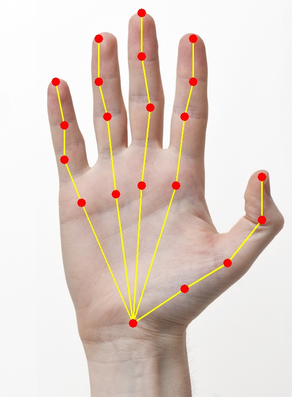

# Handpose_detection
### USAGE

#### Python
**For using it on single image :**
python handPoseImage.py

**For using on video :**
python handPoseVideo.py

There is always room for improvement. Most Welcome.

Applications:
Medical:  not capable to speak due to natural consequences.
Entertainment: Augmented Reality, Gesture Identification and more 
